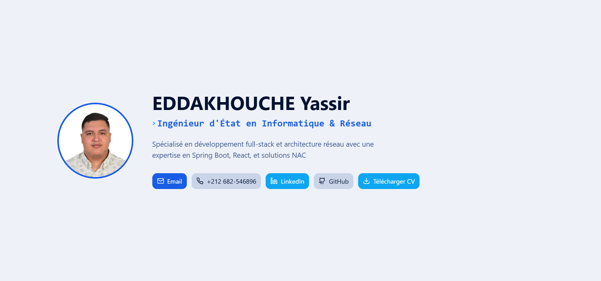

# Portfolio de Yassir Eddakhouche 🚀

---

## 🌟 À propos

Bienvenue sur mon portfolio personnel !  
Ce site présente mes compétences, mes projets réalisés et permet de me contacter facilement.  
Il est développé avec **React 18**, **Vite**, **TypeScript** et **Tailwind CSS**, pour un rendu moderne, rapide et responsive.

---

## 🎬 Démo 

  

---

## 💻 Fonctionnalités

- Présentation personnelle et compétences  
- Galerie de projets avec liens vers GitHub ou démonstration live  
- Formulaire de contact ou liens vers réseaux professionnels  
- Design responsive pour mobile et desktop  
- Navigation fluide avec animations modernes  

---

## 🛠️ Technologies utilisées

- **React 18** – Bibliothèque UI moderne  
- **Vite** – Build tool rapide et performant  
- **TypeScript** – Typage statique pour un code sûr  
- **Tailwind CSS** – Framework CSS moderne et responsive  
- **Git & GitHub** – Versioning et hébergement du code  

---

## 🚀 Installation

1. Cloner le dépôt :

git clone https://github.com/YassirEdk/Portfolio.git

cd Portfolio

2. Installer les dépendances :

npm install

ou

yarn install

3. Lancer le serveur de développement :

npm run dev

ou

yarn dev

Ouvrir le projet dans le navigateur à l’adresse affichée (par défaut http://localhost:5173).

📂 Structure du projet

Portfolio/

├─ public/          # Images, GIFs, icônes

├─ src/             # Code source

│  ├─ assets/       # Images et icônes

│  ├─ components/   # Composants React réutilisables

│  ├─ pages/        # Pages principales

│  └─ App.tsx       # Composant principal

├─ vite.config.ts    # Configuration Vite

├─ package.json      # Dépendances et scripts

└─ tailwind.config.ts# Configuration Tailwind CSS

🤝 Contact

GitHub : https://github.com/YassirEdk

Email : yassireddakhouche@gmail.com

LinkedIn : https://www.linkedin.com/in/yassir-eddakhouche-b11650239/

Merci d’avoir visité mon portfolio ! 🚀